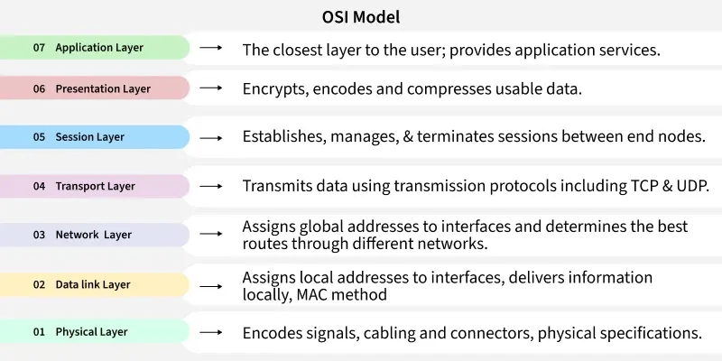
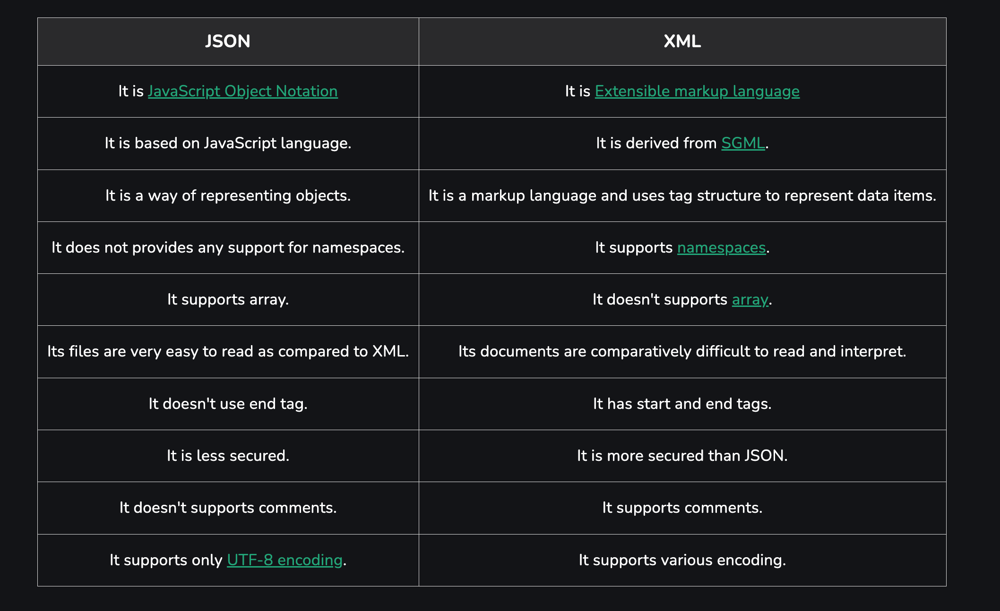
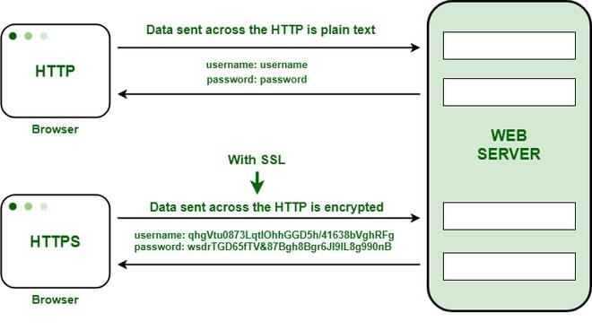
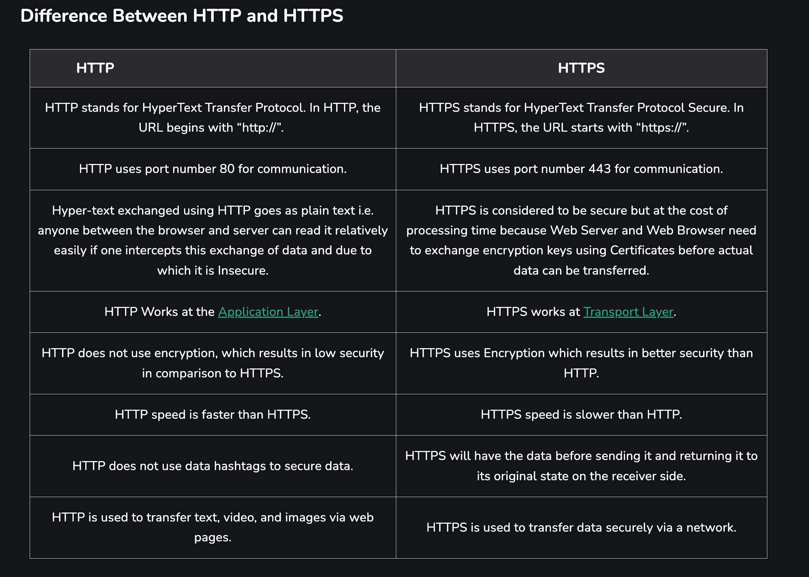

# Assignment 1: Answers

**AUHTOR**: Mert Eldemir

## Section 1: General Internet Programming Questions

1. **Briefly explain the basic working principle of the Internet.**

   The internet is a worldwide computer network that transmits a variety of data and media across interconnected devices. It works by using a packet routing network that follows **Internet Protocol** (IP) and **Transport Control Protocol** (TCP).

   **TCP** and **IP** work together to ensure that data transmission across the internet is consistent and reliable, no matter which device you’re using or where you’re using it.

2. **Explain the difference between an IP address and DNS.**

   - **IP**: An IP address, short for Internet Protocol address, is a unique string of numbers separated by periods (IPv4) or colons (IPv6). It serves as the identifier for a device on a network. Each data packet sent over the internet includes the IP address of the sender and the receiver, ensuring accurate and efficient delivery.

   - **DNS**: That is the system that translates human readable domains such like www.google.com to the IP adresses that users uses to identify each other on the internet. DNS is like the intermediate communication between our browser and the website that we want to visit.

   - **How DNS works**:

     - **Step 1**: You type a domain name into your web browser.
     - **Step 2**: Your computer sends a request to a DNS resolver, asking for the IP address of the domain.
     - **Step 3**: If the DNS resolver has the IP address cached, it returns the IP address to your computer.
     - **Step 4**: If not, the DNS resolver queries other DNS servers until it finds the correct IP address.
     - **Step 5**: Your computer then uses the received IP address to communicate with the web server hosting the website.

   | **Aspect**      | **DNS**                                             | **IP Address**                                                         |
   | --------------- | --------------------------------------------------- | ---------------------------------------------------------------------- |
   | **Function**    | Translates domain names into IP addresses           | Identifies and locates devices on a network                            |
   | **Format**      | Human-readable domain names (e.g., www.example.com) | Numeric or alphanumeric strings (e.g., 192.168.0.1 or 2001:0db8::7334) |
   | **Ease of Use** | Easy for humans to remember                         | Challenging for humans to remember                                     |
   | **Role**        | Acts as an intermediary for name resolution         | Directly used for routing and communication                            |

3. **Specify the differences between TCP and UDP.**

   - **Transmission Control Protocol TCP**: Is a **connection-oriented protocol** for communications that helps in the exchange of messages between different devices over a network.

   - **User Datagram Protocol (UDP)**: Is a **Transport Layer protocol** of the Internet Protocol (IP) that provides **fast**, **connectionless**, and **lightweight** communication **between processes**. It does not guarantee delivery, order, or error checking, making it suitable for real-time and time-sensitive applications such as video streaming, DNS, and VoIP.

   - **TCP** (Transmission Control Protocol) is a connection-oriented protocol that ensures reliable data transfer by establishing a connection before sending data, checking for errors, and retransmitting lost packets. It guarantees that data arrives in order and without loss, making it ideal for web browsing, emails, and file transfers.

   - **UDP** (User Datagram Protocol), on the other hand, is connectionless — it sends data without setting up a connection or verifying delivery. It’s faster but less reliable, as packets can be lost or arrive out of order. This makes UDP suitable for real-time applications like video streaming, online gaming, or voice calls where speed matters more than perfect accuracy.

4. **On which layer does the HTTP protocol work, and what are its basic features?**

   **OSI MODEL**

   The **OSI (Open Systems Interconnection)** Model is a **set of rules that explains how different computer systems communicate** over a network. OSI Model was developed by the **International Organization for Standardization (ISO)**

   

   The **HTTP (Hypertext Transfer Protocol)** works on the **Application Layer** of the OSI model. It defines how web browsers and servers communicate to request and deliver web content such as HTML pages, images, and videos. Its basic features include being **stateless** (each request is independent), **text-based**, and **client-server structured** (the client sends a request, and the server responds). HTTP typically uses **TCP port 80**, while its secure version, **HTTPS**, uses **port 443** and encrypts data for privacy and security.

5. **How do web browsers work?** Explain the process of loading a web page step by step.

   

   1. **Navigation:**  
      We enter a URL then the browser checks HSTS (to force HTTPS if known) and decides where to navigate.

   2. **DNS Lookup:**  
      The browser resolves the domain name to an **IP address using caches** → OS → resolver → DNS servers.

   3. **Connection:**

      - **HTTP/1.1 or HTTP/2:** Uses a TCP 3-way handshake.
      - **HTTP/3:** Uses QUIC over UDP (no TCP handshake required).

   4. **TLS Handshake (for HTTPS):**  
      Establishes a secure connection, validates the server’s certificate, and negotiates encryption protocols.

   5. **HTTP Request:**  
      The browser sends an HTTP **GET** request with headers (User-Agent, Accept, cookies, etc.).  
      If a **service worker** is installed, it may intercept this request.

   6. **HTTP Response:**  
      The server returns a response with a **status code** (e.g., 200, 301, 404), **headers**, and the **HTML body**.

   7. **Parsing HTML → Building the DOM:**  
      The HTML tokenizer converts the HTML into a **Document Object Model (DOM)**.  
      The preload scanner discovers external resources (CSS, JS, images, fonts) and requests them.

   8. **Parsing CSS → Building the CSSOM:**  
      CSS is parsed into a **CSS Object Model (CSSOM)**.  
      Note: CSS files are **render-blocking**, meaning they must be loaded before the first render.

   9. **Executing JavaScript:**  
      JavaScript files are fetched and executed.  
      Scripts without `async` or `defer` attributes block parsing until execution finishes.

   10. **Render Tree & Layout:**  
       The **DOM** and **CSSOM** combine to create a **Render Tree**.  
       The browser calculates each element’s size and position on the page.

   11. **Painting & Compositing:**  
       The browser paints visual elements onto layers, rasterizes them, and **composites** them (often via GPU) for display.

   12. **Interactivity:**  
       Event listeners attach to elements.  
       The main thread’s **event loop** manages user interactions, network requests, and scripts.

   13. **Caching:**  
       Resources are cached according to **Cache-Control** or **ETag** headers to speed up future visits.

6. **What is the difference between Frontend and Backend?** Explain with example.

   

   All websites require **front-end** and **back-end development**. **Front-end** development focuses on the visual aspects of a website — the part that users see and interact with. **Back-end development** comprises a site's structure, system, data, and logic. Together, front-end and back-end development combine to create interactive, visually pleasing websites.

   **Example**: Imagine that on the page we have the **Sign UP form**, this form is on the client side (frontend) it may implemented using the frontend technologies such as **HTML**, **CSS**, **JS** **TailwindCSS** etc. when we fill the form and press the button our frontend makes to **API POST request** to the **server** (backend) backend validate the user body data, analyze it and creating new user in the **Database**.

7. **Explain the differences between JSON and XML.**

   

   **Example JSON**:

   ```json
   {
     "student": {
       "name": "Sena",
       "age": 21,
       "department": "Computer Engineering"
     }
   }
   ```

   **Example XML**:

   ```xml
   <student>
   <name>Mert</name>
   <department>Computer Engineering</department>
   </student>
   ```

8. **What is a Restful API?** What is it used for?

   **REST API** stands for **Representational State Transfer** API. It is a type of API (Application Programming Interface) that allows **communication between different systems over the internet**. REST APIs work by **sending requests** and **receiving responses**, typically in **JSON format**, between the client and server.

   - A request is sent from the client to the server via a web URL, using one of the HTTP methods.
   - The server then responds with the requested resource, which could be HTML, XML, Image, or JSON, with JSON being the most commonly used format for modern web services.
   - These methods map to CRUD operations (Create, Read, Update, Delete) for managing resources on the web.

9. **Explain the advantages of the HTTPS protocol used for secure Internet communication.**

   **HTTPS (HyperText Transfer Protocol Secure)** is the secure version of HTTP that uses **SSL/TLS encryption** to protect data between the client and server.

   **Advantages**:

   1. **Data Encryption:**  
      Encrypts information so third parties can’t read or modify it during transfer.

   2. **Authentication:**  
      Confirms that the website you’re communicating with is genuine and not a fake or malicious site.

   3. **Data Integrity:**  
      Ensures data is not altered or corrupted while being transmitted.

   4. **User Trust:**  
      The padlock symbol and “https://” in the address bar build user confidence and credibility.

   5. **SEO Benefit:**  
      Search engines (like Google) rank HTTPS websites higher than HTTP ones.

10. **What are Cookies?** How are they used on websites?

    **Cookies** are small text files that a website stores on a user’s browser **to remember information about the user’s visit**.

    **How Cookies Used**:

    1. **Session Management:**  
       Store login status, shopping cart items, and user session IDs.

    2. **Personalization:**  
       Remember user preferences such as language, theme, or layout.

    3. **Tracking and Analytics:**  
       Monitor user behavior for analytics, ads, and improving user experience.

    4. **Security:**  
       Help detect suspicious activity and protect user accounts.

## Section 2: HTML and CSS Example Questions

1. **Predict the output of the following HTML code:**

   ```html
   <!DOCTYPE html>
   <html>
     <head>
       <title>Sample Page</title>
     </head>
     <body>
       <h1>Hello World!</h1>
       <p>This is a paragraph.</p>
       <a target href="https://www.google.com">Go to Google</a>
     </body>
   </html>
   ```

   It's actually the simple **HTML code** that has `body`, `paragraph` and the `a` link tab which redirect us on the **google.com** webpage, and makes it without opening the new window on browser, if we want to make it as on the new tab then we should pass this parameter ont he a tag: `target="_blank"`

   Here is the output (download file and click): [index.html](index.html)

2. Explain the difference between `<div>` and `<span>` tags.

   - **`<div>`** is a **block-level** element — it starts on a new line and is used to group **larger sections** of content (like paragraphs, forms, or layouts).
   - **`<span>`** is an **inline** element — it stays within a line of text and is used to style or group **small parts** of content (like words or phrases).

   **Example of usage**:

   ```html
   <div>
     <p>This is a paragraph inside a div.</p>
   </div>

   <p>
     This is <span style="color: red;">important text</span> in the same line.
   </p>
   ```

3. Explain at least 5 form elements in HTML.

   1. `<input>` — Used for user input such as text, passwords, emails, numbers, etc.

   2. `<textarea>` — Allows users to enter multi-line text (e.g., comments or messages).

   3. `<select>` — Creates a dropdown list for selecting one or more options.

   4. `<button>` — Defines a clickable button (e.g., submit, reset, or custom actions).

   5. `<option>` element defines an option that can be selected. By default, the first item in the drop-down list is selected.

4. What is the difference between ID and Class selectors in CSS? Explain with an example.

   - **ID Selector (`#id`)** — Targets a **unique** element on a page. Each ID should be used **only once**.
   - **Class Selector (`.class`)** — Targets **multiple elements** that share the same style. Can be reused many times.

   **Example usage**:

   ```html
   <span id="title">Title text</span>

   <div class="container">
     <div class="inner_box">
       <span class="inner_box_text">Some text...</span>
     </div>
   </div>
   ```

The following CSS code applies to which elements?

```css
p {
  color: red;
  font-size: 16px;
}
```

- It applies the color and the font-size css properties to the paragraph `<p></p>` tag

5. Explain at least 3 new tags introduced in HTML5.

   1. `<header>` — Defines the **top section** of a webpage or an article, usually containing logos, titles, or navigation links.

   2. `<article>` — Represents an independent piece of content, such as a blog post, news article, or forum entry.

   3. `<footer>` — Defines the bottom section of a page or article, often containing contact info, copyright, or links.

6. How do you center a div element horizontally and vertically using CSS Flexbox?

   **Example**:

   ```html
   <div class="container">
     <div class="box"></div>
   </div>
   ```

   ```css
   .container {
     display: flex;
     align-items: center;
     justify-content: center;
   }
   ```

7. What is Responsive Web Design?

   **Responsive Web Design (RWD)** is a design approach that makes web pages look and function well on all devices — desktops, tablets, and phones — by using **flexible layouts**, **fluid images**, and **CSS media queries**.

8. Write an example of a CSS media query.

   ```css
   /* Base style for mobile devices */
   body {
     background-color: olive;
     color: white;
   }

   /* For devices with a minimum width of 768px (Medium) */
   @media screen and (min-width: 768px) {
     body {
       background-color: blue;
       color: white;
     }
   }

   /* For devices with a minimum width of 992px (Large) */
   @media screen and (min-width: 992px) {
     body {
       background-color: tan;
       color: black;
     }
   }
   ```

9. Which tags are used to merge rows and columns in HTML tables?

   **`colspan`** — Merges **columns** (cells horizontally).
   **`rowspan`** — Merges **rows** (cells vertically).

   **Example**:

   ```html
   <table border="1">
     <tr>
       <th colspan="2">Header (Merged Columns)</th>
     </tr>
     <tr>
       <td rowspan="2">Row (Merged Rows)</td>
       <td>Cell 1</td>
     </tr>
     <tr>
       <td>Cell 2</td>
     </tr>
   </table>
   ```

10. How to add a hover effect to a button in CSS? Write an example.

    ```css
    .btn {
      background-color: red;
      transition: all 0.3s ease;
    }

    .btn:hover {
      background-color: blue;
    }
    ```

## Section 3: Questions About Network Protocols

1.  Explain the main differences between HTTP and HTTPS.

    

    

2.  What is FTP? What is it used for?

    **File Transfer Protocol (FTP)**: FTP or File Transfer Protocol is said to be one of the earliest and also the most **common forms of transferring files on the internet**. Located in the application layer of the OSI model, FTP is a basic system that helps in **transferring files between a client and a server**. It is what makes the FTP unique that the system provides a **reliable** and **efficient** means of **transferring files from one system to another** even if they have **different file structures and operating systems**. Contrary to other protocols such as http that cover hypertexts and web resources in general, ftp is dedicated to the management and the transfer of **text**, **binary**, or **image files**.

3.  Explain the difference between SMTP and POP3 protocols.

    | Feature        | SMTP                                                                 | POP3                                                             |
    | -------------- | -------------------------------------------------------------------- | ---------------------------------------------------------------- |
    | **Full Form**  | Simple Mail Transfer Protocol                                        | Post Office Protocol version 3                                   |
    | **Purpose**    | Used for **sending** emails from client to server or between servers | Used for **receiving** emails from the mail server to the client |
    | **Direction**  | Outgoing mail                                                        | Incoming mail                                                    |
    | **Connection** | Works while sending messages                                         | Downloads emails and usually deletes them from the server        |
    | **Port**       | Commonly uses port **25** or **587**                                 | Commonly uses port **110** (or **995** for secure POP3S)         |

4.  What is DNS? Briefly explain how it works.

    **DNS (Domain Name System)** translates **domain names** (for example `www.google.com`) into **IP addresses** that computers use to identify each other on the network.  
    When we enter a website address, our browser asks the DNS server for its IP address, then connects to that server to load the page.

5.  What is the function of the DHCP protocol?

    **DHCP (Dynamic Host Configuration Protocol)** automatically assigns **IP addresses** and other network settings (like gateway and DNS) to devices on a network.
    This saves time and prevents IP conflicts by managing addresses dynamically.

6.  What do HTTP 404 and HTTP 500 error codes mean?

    - **404 Not Found:** The server did not find the requested page.
    - **500 Internal Server Error:** The server had the unexpected failure while processing the our request.

7.  Explain the difference between Telnet and SSH.

    | Feature       | Telnet                                               | SSH                                                |
    | ------------- | ---------------------------------------------------- | -------------------------------------------------- |
    | **Full Form** | Terminal Network                                     | Secure Shell                                       |
    | **Security**  | Sends data **in plain text** (not encrypted)         | Sends data **encrypted** using SSH protocol        |
    | **Port**      | Uses port **23**                                     | Uses port **22**                                   |
    | **Usage**     | Used for remote access and device management (older) | Used for secure remote login and command execution |
    | **Safety**    | Not secure, vulnerable to attacks                    | Secure and widely used today                       |

    **Telnet** is insecure and outdated; **SSH** is its **secure replacement**.

8.  What is VPN and what is it used for?

    **VPN (Virtual Private Network)** creates a **secure, encrypted tunnel** between our device and the internet.  
    It hides our IP address, and protects data on public Wi-Fi, and allows access to the restricted region contents.

9.  What are WebSockets? How do they work?

    
    

    **HTTP** and **WebSocket** are both ways for **computers to talk to each other**, but they work in different ways. HTTP is used for **simple requests**, like when you load a webpage, where the computer sends a request and the server replies, then the connection is closed. **WebSocket** keeps the **connection open**, allowing for **real-time, two-way communication**, for things like **live chats** or **online games** where **constant updates are needed**.

    - Unlike **HTTP’s request-response model**, **WebSockets allow real-time data exchange** without repeated requests.
    - Once established, the connection stays open **until explicitly closed** by either side.
    - Reduces overhead of repeated HTTP headers, enabling **faster message delivery**.
    - Typically uses port **80** (ws://) or **443** (wss:// for secure WebSockets) and supported by Most modern browsers and server frameworks.

10. What is CDN (Content Delivery Network)? How is it used on websites?

    **CDN stands for Content Delivery Network**. It is a network that helps to **speed up web page loading for web users**. It is spread all over the world as usage of the internet is everywhere. It is basically a **distributed system** of servers that stores the data by the use of **Amazon Web services** or **Google Cloud storage** and it serves that data to the user via the **nearest server so that the loading or buffering of web pages is low**.

    
